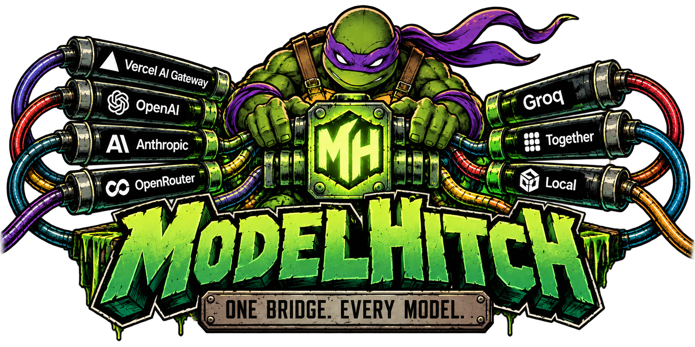
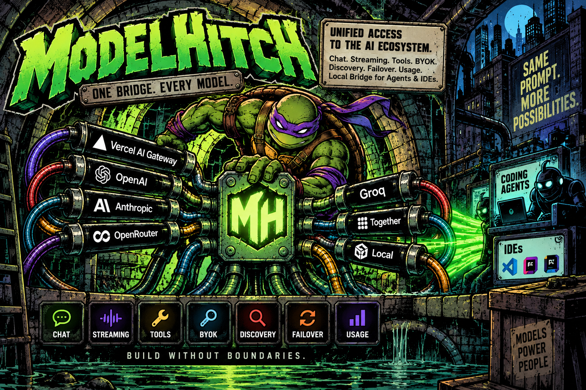
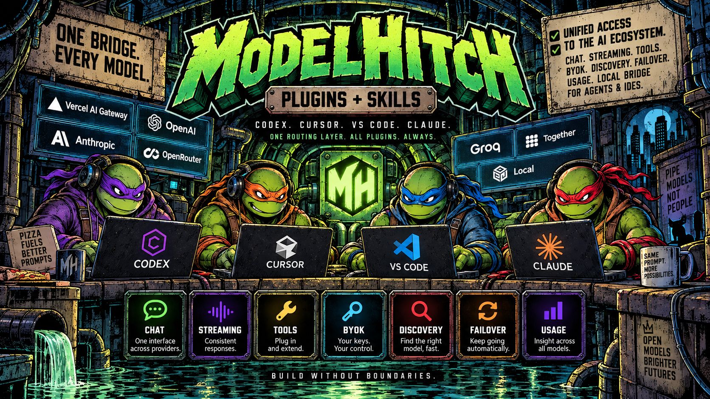
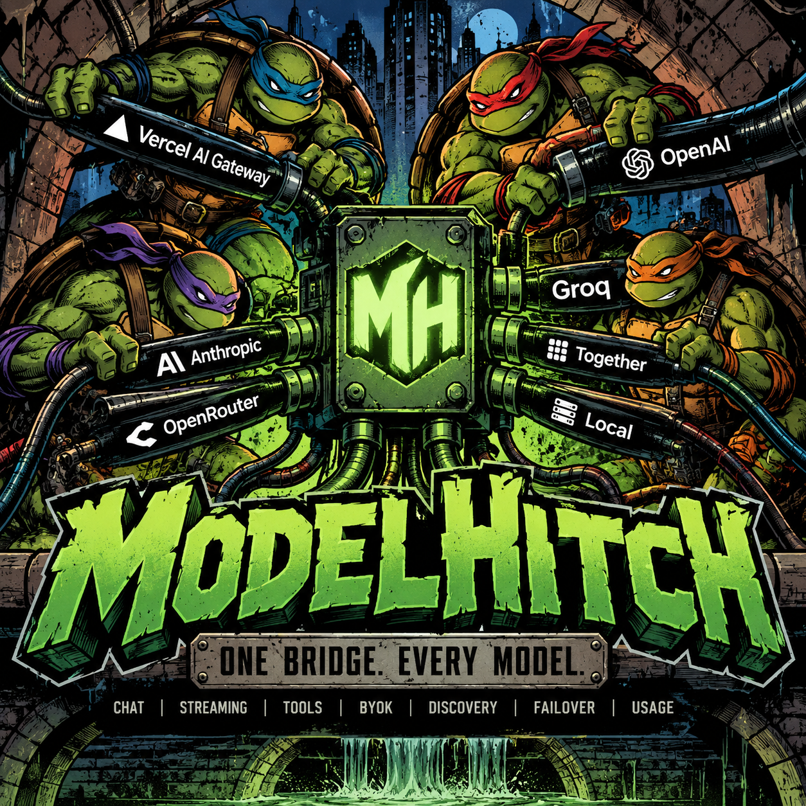
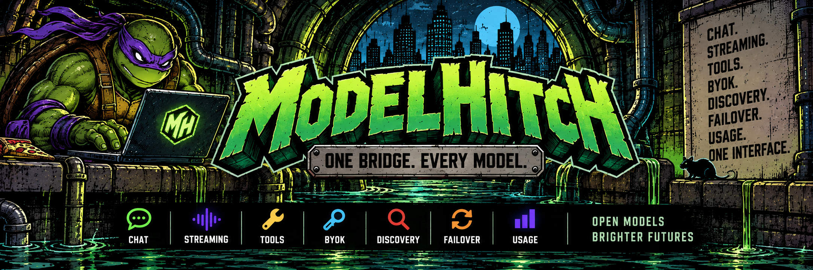

<p align="center">
  
</p>

<p align="center">
  <strong>Hitch any model to your app.</strong><br/>
  One TypeScript API. Your keys. Hosted or local. No runtime dependencies.
</p>

<p align="center">
  <a href="https://www.npmjs.com/package/modelhitch"></a>
  <a href="https://www.npmjs.com/package/modelhitch"></a>
  <a href="./LICENSE"></a>
  
  
</p>

<p align="center">
  <a href="#install">Install</a> ·
  <a href="#agent-skills--plugins">Agent skills</a> ·
  <a href="#what-you-get">Features</a> ·
  <a href="./docs/guide.md">Guide</a> ·
  <a href="./examples">Examples</a>
</p>

> Provider harness by day. Temp agency for LLMs by accident.

<p align="center">
  
</p>

Chat, stream, tools, BYOK, discovery, failover, and usage — one API across hosted and local models, plus a local multi-wire bridge for agents and IDEs.

## Install

```bash
npm install modelhitch
```

```ts
import { ModelHitch } from 'modelhitch';

const mh = new ModelHitch();
const result = await mh.chat({
  provider: 'vercel-ai-gateway',
  model: 'openai/gpt-5.4',
  messages: [{ role: 'user', content: 'Clock in.' }],
});

console.log(result.message.content);
```

Same provider-neutral types for chat, streaming, tools, custom providers, and React hooks.  
[Technical guide →](./docs/guide.md)

## Agent skills + plugins

<p align="center">
  
</p>

```bash
npx modelhitch setup codex    # claude | cursor | vscode | all
```

Defaults to a personal install. Add `--project`, `--dry-run`, or `--force` as needed.

| Agent | Skill command | Full package |
| --- | --- | --- |
| **Codex** | `npx modelhitch setup codex` | [Plugin guide](./.agents/plugins/README.md) |
| **Claude** | `npx modelhitch setup claude` | [Two-skill guide](./.claude/skills/README.md) |
| **Cursor** | `npx modelhitch setup cursor` | [Plugin guide](./.cursor-plugin/README.md) |
| **VS Code / Copilot** | `npx modelhitch setup vscode` | [Agent Plugin guide](./.github/plugin/README.md) |

## What you get

<p align="center">
  
</p>

| Surface | Included |
| --- | --- |
| **Library** | `chat`, `stream`, tools, model discovery, typed errors, custom providers |
| **Web apps** | Browser bundler support via `modelhitch/browser` — no Node polyfills |
| **Android** | Native Kotlin SDK, coroutine streaming, Compose sample, Keystore BYOK |
| **Flutter** | Dart SDK, SSE streaming, secure BYOK, OpenAI-compatible providers |
| **BYOK** | Request keys, memory store, browser local storage, env fallback |
| **React** | `useChat`, `useStream`, bridge client via `modelhitch/react` |
| **Bridge** | OpenAI Chat/Responses/Images, Anthropic Messages, Gemini GenerateContent |
| **Reliability** | Automatic 429/5xx/network failover across models and providers |
| **Usage** | Tokens, estimated spend, latency, failovers, dashboard, optional SQLite |

### Providers

`Vercel AI Gateway` · `OpenAI` · `Anthropic` · `Groq` · `OpenRouter` ·
`Together AI` · `HuggingFace` · `Google Gemini` · `DeepSeek` · `xAI` ·
`Mistral` · `Moonshot` · `Z.ai (GLM)` · `LM Studio` · `Ollama` · `vLLM` · `llama.cpp` ·
`KoboldCpp` · `mock`

## Android SDK

Native Kotlin for Android 6.0+ — no Node/JS runtime embedded.

- Provider-neutral chat types + `Flow` streaming + tool-call events
- Built-in OpenAI-compatible providers, typed errors, model listing
- AES-GCM credentials via Android Keystore

```kotlin
dependencies {
  implementation("io.github.bobbybacklogs.modelhitch:modelhitch-android:0.1.0")
}
```

```kotlin
val keys = AndroidKeyStoreCredentialStore(applicationContext)
keys.set(selectedProviderId, userProvidedKey)

val hitch = ModelHitch(
  providers = DefaultProviders.all,
  keyStore = keys,
)

hitch.stream(
  ChatRequest(
    provider = selectedProviderId,
    model = selectedModelId,
    messages = listOf(ModelMessage.User(text("Hello from Android"))),
  ),
).collect { chunk ->
  if (chunk is StreamChunk.TextDelta) append(chunk.text)
}
```

[Android guide →](./android-sdk/README.md)

## Dart and Flutter SDKs

Dart 3.4 core + Flutter 3.22 adapter in [`flutter-sdk`](./flutter-sdk).

- `modelhitch_dart` — types, OpenAI-compatible transport, SSE streams, errors, listing
- `modelhitch_flutter` — same core + encrypted BYOK via `flutter_secure_storage`
- Device-user keys only; app-owned credentials should hit a backend or bridge

```yaml
dependencies:
  modelhitch_flutter: ^0.1.0
```

```dart
final hitch = ModelHitch(keyStore: FlutterSecureKeyStore());

hitch.stream(
  ChatRequest(
    provider: 'openai',
    model: 'gpt-4o-mini',
    messages: [ModelMessage.user(MessageContent.text('Hello from Flutter'))],
  ),
).listen((chunk) {
  if (chunk case TextDelta(:final text)) append(text);
});
```

[Dart/Flutter guide →](./flutter-sdk/README.md)

## Expo / React Native SDK

Thin adapter over `modelhitch` for Expo SDK 52+ and React Native.

- `expo/fetch` streaming + `expo-secure-store` BYOK
- Metro-safe entry (no Node-only modules)
- Same BYOK contract as Android/Dart — iOS, Android, and Expo web

```bash
npx expo install expo-secure-store
npm install modelhitch modelhitch-expo
```

```ts
import { createExpoModelHitch } from 'modelhitch-expo';

const mh = createExpoModelHitch({ defaultProviderId: 'openai' });
await mh.keystore?.set('openai', keyPastedByUser);

const stream = await mh.stream({
  model: 'gpt-4o-mini',
  messages: [{ role: 'user', content: 'Hello from Expo' }],
});

for await (const chunk of stream) {
  if (chunk.type === 'text-delta') appendText(chunk.text);
}
```

[Expo guide →](./expo-sdk/README.md)

## Local agent bridge

```bash
npx modelhitch bridge --background
npx modelhitch status
npx modelhitch settings
```

| | |
| --- | --- |
| **Endpoint** | `http://127.0.0.1:3939/v1` — route as `providerId/modelId` |
| **Usage** | `http://127.0.0.1:3939/usage` |
| **Settings** | Web UI or `modelhitch settings` (OpenTUI; Bun required for the TUI) |
| **Image lane** | Off by default — enable in settings or with `--image-lane` |
| **Runtime** | Bridge needs Node 22.5+ (SQLite); library supports Node 18+ |

[Bridge guide →](./docs/guide.md#local-agent-bridge)

## Development

```bash
npm install
npm run typecheck
npm test
npm run build
```

Try without a key: [quickstart](./examples/quickstart.ts), [BYOK UI](./examples/byok-ui), [Expo app](./examples/expo-app) (mock provider). MIT licensed — public contributions are currently closed.

<p align="center">
  
</p>
